# Flowchart Sistem Aplikasi Seblak Predator

## Diagram Alur Lengkap Aplikasi

```mermaid
flowchart TD
    Start([User Mengakses Aplikasi]) --> CheckSession{Session<br/>Aktif?}
    
    CheckSession -->|Tidak| LoginPage[Halaman Login]
    CheckSession -->|Ya| CheckRole{Cek Role<br/>User}
    
    LoginPage --> InputCredentials[Input Username & Password]
    InputCredentials --> ValidateAuth{Validasi<br/>Autentikasi}
    
    ValidateAuth -->|Gagal| LoginError[Tampilkan Error]
    LoginError --> LoginPage
    
    ValidateAuth -->|Berhasil| CreateSession[Buat Session]
    CreateSession --> CheckRole
    
    CheckRole -->|Customer| AccessDenied[Access Denied:<br/>Customer tidak dapat akses]
    CheckRole -->|Admin/Owner| CheckPermissions[Cek Permissions<br/>Menu Berdasarkan Role]
    
    AccessDenied --> End([Selesai])
    
    CheckPermissions --> Dashboard[Dashboard]
    
    Dashboard --> MenuUtama{Pilih Menu}
    
    MenuUtama -->|Kategori| MenuKategori[Manajemen Kategori]
    MenuUtama -->|Menu Produk| MenuProduct[Manajemen Menu]
    MenuUtama -->|Topping| MenuTopping[Manajemen Topping]
    MenuUtama -->|Transaksi| MenuTransaksi[Manajemen Transaksi]
    MenuUtama -->|User| MenuUser[Manajemen User]
    MenuUtama -->|Role| MenuRole[Manajemen Role]
    MenuUtama -->|Logout| Logout[Logout & Hapus Session]
    
    Logout --> End
    
    %% KATEGORI FLOW
    MenuKategori --> KategoriAction{Pilih Aksi}
    KategoriAction -->|Lihat| ViewKategori[Tampilkan Daftar Kategori<br/>Tabel & Card View]
    KategoriAction -->|Tambah| AddKategori[Form Tambah Kategori]
    KategoriAction -->|Edit| EditKategori[Form Edit Kategori]
    KategoriAction -->|Hapus| DeleteKategori[Soft Delete Kategori]
    KategoriAction -->|Filter Deleted| FilterDeleted[Tampilkan Kategori Terhapus]
    
    ViewKategori --> MenuUtama
    AddKategori --> SaveKategori[Simpan ke Database]
    SaveKategori --> MenuKategori
    EditKategori --> UpdateKategori[Update Database]
    UpdateKategori --> MenuKategori
    DeleteKategori --> MenuKategori
    FilterDeleted --> RestoreOption{Restore?}
    RestoreOption -->|Ya| RestoreKategori[Restore Kategori]
    RestoreOption -->|Tidak| MenuKategori
    RestoreKategori --> MenuKategori
    
    %% MENU PRODUCT FLOW
    MenuProduct --> ProductAction{Pilih Aksi}
    ProductAction -->|Lihat| ViewProduct[Tampilkan Daftar Produk<br/>is_topping = 0]
    ProductAction -->|Tambah| AddProduct[Form Tambah Produk<br/>+ Upload Gambar]
    ProductAction -->|Edit| EditProduct[Form Edit Produk<br/>+ Update Gambar]
    ProductAction -->|Hapus| DeleteProduct[Hapus Produk]
    ProductAction -->|Toggle Status| ToggleProductStatus[Aktif/Nonaktif Produk]
    
    ViewProduct --> MenuUtama
    AddProduct --> ValidateImage{Validasi<br/>Gambar}
    ValidateImage -->|Invalid| ImageError[Error: Format/Ukuran]
    ValidateImage -->|Valid| UploadImage[Upload ke uploads/menu-images/]
    ImageError --> AddProduct
    UploadImage --> SaveProduct[Simpan Product + Image Path]
    SaveProduct --> MenuProduct
    EditProduct --> UpdateProduct[Update Database]
    UpdateProduct --> MenuProduct
    DeleteProduct --> MenuProduct
    ToggleProductStatus --> MenuProduct
    
    %% TOPPING FLOW
    MenuTopping --> ToppingAction{Pilih Aksi}
    ToppingAction -->|Lihat| ViewTopping[Tampilkan Daftar Topping<br/>is_topping = 1]
    ToppingAction -->|Tambah| AddTopping[Form Tambah Topping<br/>+ Upload Gambar]
    ToppingAction -->|Edit| EditTopping[Form Edit Topping]
    ToppingAction -->|Hapus| DeleteTopping[Hapus Topping]
    
    ViewTopping --> MenuUtama
    AddTopping --> SaveTopping[Simpan Topping]
    SaveTopping --> MenuTopping
    EditTopping --> UpdateTopping[Update Database]
    UpdateTopping --> MenuTopping
    DeleteTopping --> MenuTopping
    
    %% TRANSAKSI FLOW
    MenuTransaksi --> TransaksiView{Mode Tampilan}
    TransaksiView -->|Lihat Daftar| ViewOrders[Tampilkan Daftar Order<br/>+ Filter & Search]
    TransaksiView -->|Buat Baru| TransaksiWizard[Wizard Transaksi Baru<br/>4 Steps]
    
    ViewOrders --> OrderAction{Aksi Order}
    OrderAction -->|Detail| ViewOrderDetail[Lihat Detail Order<br/>+ Items & Toppings]
    OrderAction -->|Update Status| UpdateOrderStatus[Update Status Order]
    OrderAction -->|Hapus| DeleteOrder[Hapus Order]
    OrderAction -->|Complete| CompleteOrder[Selesaikan Order]
    
    ViewOrderDetail --> ViewOrders
    UpdateOrderStatus --> ViewOrders
    DeleteOrder --> ViewOrders
    CompleteOrder --> ViewOrders
    ViewOrders --> MenuUtama
    
    %% WIZARD TRANSAKSI
    TransaksiWizard --> Step1[Step 1: Data Pelanggan<br/>Nama, Meja, Telepon, Catatan]
    Step1 --> ValidateStep1{Validasi<br/>Nama?}
    ValidateStep1 -->|Tidak Valid| Step1
    ValidateStep1 -->|Valid| Step2[Step 2: Pilih Produk<br/>Select Menu Seblak + Qty]
    
    Step2 --> ValidateStep2{Ada<br/>Produk?}
    ValidateStep2 -->|Tidak| Step2
    ValidateStep2 -->|Ya| Step3[Step 3: Pilih Topping<br/>Tambah Topping ke Produk]
    
    Step3 --> Step4[Step 4: Pembayaran<br/>Pilih Metode Bayar]
    
    Step4 --> PaymentMethod{Metode<br/>Pembayaran?}
    
    PaymentMethod -->|Cash| ProcessCash[Simpan Order<br/>Status: Pending<br/>Payment: Unpaid]
    ProcessCash --> SaveOrderDB[(Database:<br/>orders, order_items,<br/>order_item_toppings)]
    SaveOrderDB --> SuccessCash[Success: Bayar di Kasir]
    SuccessCash --> ViewOrders
    
    PaymentMethod -->|Midtrans| CallMidtransAPI[Request Snap Token<br/>ke Midtrans API]
    CallMidtransAPI --> ValidateEmail{Email<br/>Valid?}
    ValidateEmail -->|Tidak| FixEmail[Generate Email<br/>dari Phone atau Default]
    ValidateEmail -->|Ya| MidtransAPI[Midtrans API<br/>Create Transaction]
    FixEmail --> MidtransAPI
    
    MidtransAPI --> GetSnapToken{Snap Token<br/>Berhasil?}
    GetSnapToken -->|Gagal| ErrorMidtrans[Error: Gagal dapat Token]
    GetSnapToken -->|Berhasil| OpenSnapPopup[Buka Snap Popup<br/>Payment Gateway]
    
    ErrorMidtrans --> Step4
    
    OpenSnapPopup --> UserPayment{User<br/>Action?}
    
    UserPayment -->|Success| PaymentSuccess[Payment Success<br/>Save Order + Payment Info]
    UserPayment -->|Pending| PaymentPending[Payment Pending<br/>Save Order Status Pending]
    UserPayment -->|Error| PaymentError[Payment Failed]
    UserPayment -->|Close| PaymentCancelled[User Cancelled]
    
    PaymentSuccess --> SaveOrderSuccess[(Simpan Order<br/>+ Midtrans Transaction ID)]
    SaveOrderSuccess --> SuccessMidtrans[Success Dialog<br/>+ Order Number]
    SuccessMidtrans --> ViewOrders
    
    PaymentPending --> SaveOrderPending[(Simpan Order<br/>Status: Pending)]
    SaveOrderPending --> PendingNotif[Info: Complete Payment]
    PendingNotif --> ViewOrders
    
    PaymentError --> ErrorNotif[Error Notification]
    PaymentCancelled --> CancelNotif[Warning: Cancelled]
    ErrorNotif --> Step4
    CancelNotif --> Step4
    
    %% USER MANAGEMENT
    MenuUser --> UserAction{Pilih Aksi}
    UserAction -->|Lihat| ViewUsers[Tampilkan Daftar User<br/>+ Role Info]
    UserAction -->|Tambah| AddUser[Form Tambah User<br/>Username, Password, Email, Role]
    UserAction -->|Edit| EditUser[Form Edit User<br/>Update Info & Role]
    UserAction -->|Hapus| DeleteUser[Hapus User]
    UserAction -->|Reset Password| ResetPassword[Reset Password User]
    
    ViewUsers --> MenuUtama
    AddUser --> ValidateUser{Validasi<br/>Input}
    ValidateUser -->|Invalid| UserError[Error Validation]
    ValidateUser -->|Valid| HashPassword[Hash Password]
    UserError --> AddUser
    HashPassword --> SaveUser[Simpan User ke DB]
    SaveUser --> MenuUser
    EditUser --> UpdateUser[Update User]
    UpdateUser --> MenuUser
    DeleteUser --> MenuUser
    ResetPassword --> MenuUser
    
    %% ROLE MANAGEMENT
    MenuRole --> RoleAction{Pilih Aksi}
    RoleAction -->|Lihat| ViewRoles[Tampilkan Daftar Role<br/>+ Permissions]
    RoleAction -->|Tambah| AddRole[Form Tambah Role<br/>+ Set Permissions]
    RoleAction -->|Edit| EditRole[Form Edit Role<br/>+ Update Permissions]
    RoleAction -->|Hapus| DeleteRole[Hapus Role]
    
    ViewRoles --> MenuUtama
    AddRole --> SetPermissions[Pilih Menu Permissions<br/>Dashboard, Menu, Topping, dll]
    SetPermissions --> SaveRole[Simpan Role + Permissions]
    SaveRole --> MenuRole
    EditRole --> UpdatePermissions[Update Permissions]
    UpdatePermissions --> UpdateRole[Update Role]
    UpdateRole --> MenuRole
    DeleteRole --> CheckRoleUsage{Role<br/>Digunakan?}
    CheckRoleUsage -->|Ya| ErrorRoleInUse[Error: Role masih dipakai]
    CheckRoleUsage -->|Tidak| ConfirmDeleteRole[Hapus Role]
    ErrorRoleInUse --> MenuRole
    ConfirmDeleteRole --> MenuRole
    
    style Start fill:#90EE90
    style End fill:#FFB6C1
    style Dashboard fill:#87CEEB
    style SaveOrderDB fill:#FFD700
    style SaveOrderSuccess fill:#90EE90
    style SaveOrderPending fill:#FFA500
    style OpenSnapPopup fill:#9370DB
    style PaymentSuccess fill:#32CD32
    style AccessDenied fill:#FF6347
```

## Keterangan Warna:
- 🟢 **Hijau Muda**: Start/Success
- 🔵 **Biru Muda**: Dashboard (Menu Utama)
- 🟡 **Kuning**: Database Operations
- 🟣 **Ungu**: Midtrans Payment Gateway
- 🔴 **Merah**: Access Denied/Error

## Penjelasan Alur Utama:

### 1. **Authentication Flow**
- User akses aplikasi → Cek session
- Jika belum login → Halaman Login
- Input credentials → Validasi → Buat session
- Cek role: Customer ditolak, Admin/Owner lanjut

### 2. **Authorization Flow**
- Setelah login, cek permissions berdasarkan role
- Hanya tampilkan menu yang diizinkan untuk role tersebut

### 3. **CRUD Operations**
- Setiap modul (Kategori, Menu, Topping, User, Role) memiliki operasi standar:
  - Create (Tambah)
  - Read (Lihat/View)
  - Update (Edit)
  - Delete (Hapus)

### 4. **Transaction Wizard (4 Steps)**
- **Step 1**: Input data pelanggan (mandatory: nama)
- **Step 2**: Pilih produk seblak + quantity (mandatory: minimal 1)
- **Step 3**: Pilih topping per produk (optional)
- **Step 4**: Pilih metode pembayaran dan proses

### 5. **Payment Flow**
- **Cash**: Langsung simpan order, status pending, bayar di kasir
- **Midtrans**: 
  - Request Snap Token
  - Buka payment popup
  - Handle callback (success/pending/error/close)
  - Simpan order + transaction info

### 6. **Data Flow**
- Semua data tersimpan di database `seblak_app`
- Transaction data: orders → order_items → order_item_toppings
- No stock tracking (prasmanan system)

## File Implementasi:
- **Authentication**: `config/session.php`, `services/WebAuthService.php`
- **Frontend**: `dist/dashboard/pages/*.php`
- **API**: `api/orders.php`, `api/midtrans/create-transaction.php`
- **Database**: `sql/*.sql`
