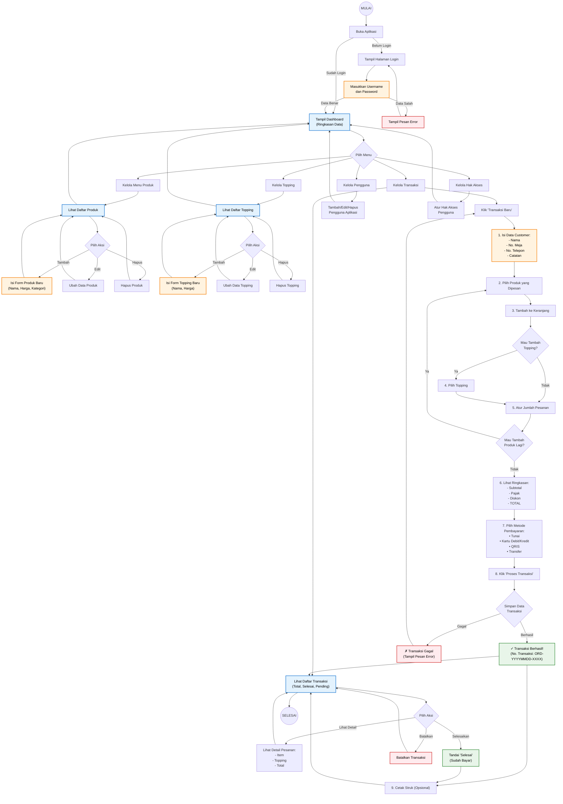

# Alur Kerja Sistem - Aplikasi Seblak Predator

Diagram ini menjelaskan cara kerja aplikasi Seblak Predator dari awal sampai akhir, dengan bahasa yang mudah dipahami.



## Keterangan
- **Kotak Biru**: Proses melihat/menampilkan data
- **Kotak Oranye**: Input data / formulir
- **Kotak Hijau**: Proses berhasil
- **Kotak Merah**: Error / pembatalan
- **Belah Ketupat**: Pilihan keputusan

## Cara Kerja Aplikasi (Ringkasan)

### 1. Login
- Buka aplikasi → Masukkan username & password → Jika benar, masuk ke Dashboard

### 2. Kelola Menu & Topping
- Dari Dashboard, pilih "Menu Produk" atau "Topping"
- Bisa tambah, edit, atau hapus data
- Produk: Seblak, Minuman, dll dengan harga
- Topping: Tambahan yang bisa dipilih customer

### 3. Buat Transaksi Baru
1. Klik "Transaksi Baru"
2. Isi nama customer, nomor meja
3. Pilih produk yang dipesan (misal: Seblak Original)
4. Tambah topping jika perlu (misal: Keju, Sosis)
5. Atur jumlah pesanan
6. Bisa tambah produk lain lagi
7. Lihat total harga
8. Pilih cara bayar (Tunai/QRIS/Transfer/Kartu)
9. Klik "Proses Transaksi"
10. Cetak struk (opsional)

### 4. Kelola Transaksi
- Lihat daftar semua transaksi
- Bisa filter: Hari ini, Pending, Selesai
- Bisa lihat detail pesanan
- Tandai "Selesai" jika sudah bayar
- Batalkan jika ada kesalahan

### 5. Kelola User & Hak Akses
- Tambah pengguna baru (kasir, admin)
- Atur siapa saja yang boleh akses menu tertentu

---

## Catatan Penting
- ✅ Harga produk & topping tersimpan saat transaksi dibuat (tidak berubah meski harga di menu diubah)
- ✅ Sistem prasmanan: tidak perlu hitung stok barang
- ✅ Nomor transaksi otomatis: ORD-20251022-0001 (tanggal + nomor urut)

---

## Cara Export Diagram ke Gambar (PNG/SVG)

### Opsi 1: Menggunakan Website Online (Paling Mudah)
1. Buka https://mermaid.live/
2. Copy semua kode diagram (yang ada di antara \`\`\`mermaid dan \`\`\`)
3. Paste ke editor di website
4. Klik tombol "Download PNG" atau "Download SVG"

### Opsi 2: Menggunakan VS Code
1. Install extension "Markdown Preview Mermaid Support"
2. Buka file ini di VS Code
3. Tekan `Ctrl+Shift+V` untuk preview
4. Klik kanan pada diagram → "Copy Image" atau screenshot

### Opsi 3: Menggunakan Command Line (Untuk Developer)
```bash
# Install tool Mermaid CLI
npm install -g @mermaid-js/mermaid-cli

# Simpan kode mermaid ke file flowchart.mmd
# Lalu convert:
mmdc -i flowchart.mmd -o system_flowchart.png
```

---

## Informasi Tambahan
- Diagram ini bisa dilihat langsung di GitHub (tanpa export)
- Cocok untuk dokumentasi, presentasi, atau training karyawan baru
- Flowchart ini menjelaskan SEMUA fitur yang ada di aplikasi Seblak Predator