# Flowchart Sederhana Sistem Aplikasi Seblak Predator

Berikut adalah flowchart lengkap sistem aplikasi Seblak Predator yang dibuat menggunakan Mermaid. Flowchart ini dirancang sederhana agar mudah dipahami semua orang, termasuk user awam.

## Flowchart Lengkap Sistem Aplikasi

```mermaid
flowchart TD
    START((MULAI)) --> OPEN[Buka Aplikasi<br/>Seblak Predator]
    
    OPEN --> CHECK_SESSION{Sudah<br/>Pernah Login?}
    
    CHECK_SESSION -->|Belum| LOGIN_PAGE[Tampil Halaman Login]
    CHECK_SESSION -->|Sudah| CHECK_ROLE
    
    LOGIN_PAGE --> INPUT_LOGIN[Ketik Username<br/>dan Password]
    INPUT_LOGIN --> VALIDATE_LOGIN{Login<br/>Berhasil?}
    
    VALIDATE_LOGIN -->|Salah| ERROR_LOGIN[Tampil Pesan:<br/>Username/Password Salah]
    ERROR_LOGIN --> LOGIN_PAGE
    
    VALIDATE_LOGIN -->|Benar| CHECK_ROLE{Cek Jabatan<br/>Pengguna}
    
    CHECK_ROLE -->|Customer/Pembeli| DENY_ACCESS[Maaf, Pembeli<br/>Tidak Bisa Akses]
    DENY_ACCESS --> END_DENY((SELESAI))
    
    CHECK_ROLE -->|Admin/Pemilik| CHECK_PERMISSION[Lihat Hak Akses<br/>Sesuai Jabatan]
    CHECK_PERMISSION --> DASHBOARD[Masuk Halaman<br/>Utama Dashboard]
    
    DASHBOARD --> MAIN_MENU{Pilih Menu<br/>yang Ingin Dikelola}
    
    %% KATEGORI
    MAIN_MENU -->|Kategori| KATEGORI_PAGE[Kelola Kategori<br/>Makanan/Topping]
    KATEGORI_PAGE --> KATEGORI_VIEW[Lihat Daftar Kategori<br/>Tampilan Tabel & Kartu]
    KATEGORI_VIEW --> KATEGORI_ACTION{Pilih Aksi}
    
    KATEGORI_ACTION -->|Tambah Baru| KATEGORI_ADD[Isi Form:<br/>Nama Kategori, Jenis]
    KATEGORI_ACTION -->|Ubah Data| KATEGORI_EDIT[Edit Kategori<br/>yang Dipilih]
    KATEGORI_ACTION -->|Hapus| KATEGORI_DELETE[Hapus Kategori<br/>Masuk ke Tempat Sampah]
    KATEGORI_ACTION -->|Lihat Terhapus| KATEGORI_TRASH[Lihat Kategori<br/>di Tempat Sampah]
    KATEGORI_ACTION -->|Kembali| DASHBOARD
    
    KATEGORI_ADD --> KATEGORI_SAVE[Simpan Kategori Baru]
    KATEGORI_SAVE --> KATEGORI_VIEW
    KATEGORI_EDIT --> KATEGORI_UPDATE[Simpan Perubahan]
    KATEGORI_UPDATE --> KATEGORI_VIEW
    KATEGORI_DELETE --> KATEGORI_VIEW
    KATEGORI_TRASH --> RESTORE_OPT{Mau Pulihkan?}
    RESTORE_OPT -->|Ya| KATEGORI_RESTORE[Pulihkan Kategori]
    RESTORE_OPT -->|Tidak| KATEGORI_VIEW
    KATEGORI_RESTORE --> KATEGORI_VIEW
    
    %% MENU SEBLAK
    MAIN_MENU -->|Menu Seblak| MENU_PAGE[Kelola Menu<br/>Makanan Seblak]
    MENU_PAGE --> MENU_VIEW[Lihat Daftar<br/>Menu Seblak]
    MENU_VIEW --> MENU_ACTION{Pilih Aksi}
    
    MENU_ACTION -->|Tambah Menu| MENU_ADD[Isi Form Menu Baru:<br/>Nama, Harga, Kategori,<br/>Upload Foto]
    MENU_ACTION -->|Ubah Menu| MENU_EDIT[Edit Menu:<br/>Ubah Info & Foto]
    MENU_ACTION -->|Hapus Menu| MENU_DELETE[Hapus Menu Seblak]
    MENU_ACTION -->|Aktif/Nonaktif| MENU_TOGGLE[Ubah Status Menu<br/>Tersedia/Tidak]
    MENU_ACTION -->|Kembali| DASHBOARD
    
    MENU_ADD --> MENU_UPLOAD{Upload<br/>Foto Menu?}
    MENU_UPLOAD -->|Ya| MENU_CHECK_IMG{Foto Valid?<br/>JPG/PNG, Max 5MB}
    MENU_CHECK_IMG -->|Tidak| MENU_IMG_ERROR[Foto Tidak Sesuai<br/>Coba Lagi]
    MENU_IMG_ERROR --> MENU_ADD
    MENU_CHECK_IMG -->|Ya| MENU_SAVE_IMG[Simpan Foto Menu]
    MENU_SAVE_IMG --> MENU_SAVE[Simpan Menu Baru]
    MENU_UPLOAD -->|Tidak| MENU_SAVE
    MENU_SAVE --> MENU_VIEW
    MENU_EDIT --> MENU_UPDATE[Simpan Perubahan]
    MENU_UPDATE --> MENU_VIEW
    MENU_DELETE --> MENU_VIEW
    MENU_TOGGLE --> MENU_VIEW
    
    %% TOPPING
    MAIN_MENU -->|Topping/Tambahan| TOPPING_PAGE[Kelola Topping<br/>Bahan Tambahan]
    TOPPING_PAGE --> TOPPING_VIEW[Lihat Daftar Topping<br/>Keju, Sosis, dll]
    TOPPING_VIEW --> TOPPING_ACTION{Pilih Aksi}
    
    TOPPING_ACTION -->|Tambah Topping| TOPPING_ADD[Isi Form Topping:<br/>Nama, Harga, Upload Foto]
    TOPPING_ACTION -->|Ubah Topping| TOPPING_EDIT[Edit Info Topping]
    TOPPING_ACTION -->|Hapus| TOPPING_DELETE[Hapus Topping]
    TOPPING_ACTION -->|Kembali| DASHBOARD
    
    TOPPING_ADD --> TOPPING_SAVE[Simpan Topping Baru]
    TOPPING_SAVE --> TOPPING_VIEW
    TOPPING_EDIT --> TOPPING_UPDATE[Simpan Perubahan]
    TOPPING_UPDATE --> TOPPING_VIEW
    TOPPING_DELETE --> TOPPING_VIEW
    
    %% TRANSAKSI
    MAIN_MENU -->|Transaksi Penjualan| TRANSAKSI_PAGE[Kelola Transaksi<br/>Penjualan]
    TRANSAKSI_PAGE --> TRANSAKSI_MAIN{Pilih Menu<br/>Transaksi}
    
    TRANSAKSI_MAIN -->|Lihat Riwayat| TRANSAKSI_LIST[Lihat Daftar<br/>Semua Transaksi]
    TRANSAKSI_LIST --> TRANSAKSI_LIST_ACTION{Pilih Aksi}
    TRANSAKSI_LIST_ACTION -->|Lihat Detail| TRANSAKSI_DETAIL[Lihat Detail Pesanan<br/>+ Total Belanja]
    TRANSAKSI_LIST_ACTION -->|Ubah Status| TRANSAKSI_STATUS[Ubah Status:<br/>Pending/Selesai/Batal]
    TRANSAKSI_LIST_ACTION -->|Hapus| TRANSAKSI_DELETE[Hapus Transaksi]
    TRANSAKSI_LIST_ACTION -->|Kembali| DASHBOARD
    TRANSAKSI_DETAIL --> TRANSAKSI_LIST
    TRANSAKSI_STATUS --> TRANSAKSI_LIST
    TRANSAKSI_DELETE --> TRANSAKSI_LIST
    
    TRANSAKSI_MAIN -->|Buat Pesanan Baru| TRANSAKSI_NEW[Mulai Transaksi Baru<br/>Proses 4 Langkah]
    
    TRANSAKSI_NEW --> STEP1[LANGKAH 1:<br/>Isi Data Pembeli<br/>Nama, Meja, Telepon]
    STEP1 --> CHECK_STEP1{Nama Pembeli<br/>Sudah Diisi?}
    CHECK_STEP1 -->|Belum| ERROR_STEP1[Nama Wajib Diisi]
    ERROR_STEP1 --> STEP1
    CHECK_STEP1 -->|Sudah| STEP2
    
    STEP2[LANGKAH 2:<br/>Pilih Menu Seblak<br/>+ Tentukan Jumlah Porsi]
    STEP2 --> CHECK_STEP2{Sudah Pilih<br/>Menu?}
    CHECK_STEP2 -->|Belum| ERROR_STEP2[Minimal Pilih<br/>1 Menu]
    ERROR_STEP2 --> STEP2
    CHECK_STEP2 -->|Sudah| STEP3
    
    STEP3[LANGKAH 3:<br/>Tambah Topping<br/>Keju, Sosis, dll<br/>Boleh Dilewati]
    STEP3 --> STEP4
    
    STEP4[LANGKAH 4:<br/>Lihat Ringkasan Pesanan<br/>+ Total Harga]
    STEP4 --> CHOOSE_PAYMENT{Pilih Cara<br/>Pembayaran}
    
    CHOOSE_PAYMENT -->|Tunai/Cash| PAYMENT_CASH[Bayar Tunai<br/>di Kasir]
    PAYMENT_CASH --> SAVE_CASH[Simpan Pesanan<br/>Status: Belum Bayar]
    SAVE_CASH --> SUCCESS_CASH[✓ Pesanan Tersimpan<br/>Silakan Bayar di Kasir]
    SUCCESS_CASH --> TRANSAKSI_LIST
    
    CHOOSE_PAYMENT -->|Kartu/QRIS/E-Wallet| PAYMENT_ONLINE[Bayar Online<br/>via Midtrans]
    PAYMENT_ONLINE --> VALIDATE_EMAIL{Data Pembeli<br/>Lengkap?}
    VALIDATE_EMAIL -->|Tidak| FIX_EMAIL[Perbaiki Data<br/>Email/Telepon]
    FIX_EMAIL --> GENERATE_TOKEN
    VALIDATE_EMAIL -->|Ya| GENERATE_TOKEN[Hubungi Bank<br/>Minta Token Bayar]
    
    GENERATE_TOKEN --> TOKEN_OK{Token<br/>Berhasil?}
    TOKEN_OK -->|Gagal| ERROR_TOKEN[Koneksi Bermasalah<br/>Coba Lagi]
    ERROR_TOKEN --> STEP4
    
    TOKEN_OK -->|Berhasil| OPEN_PAYMENT[Buka Jendela Pembayaran<br/>Pilih: Kartu/GoPay/<br/>ShopeePay/Transfer]
    
    OPEN_PAYMENT --> USER_PAY{Pembeli<br/>Melakukan<br/>Pembayaran}
    
    USER_PAY -->|Bayar Berhasil| PAY_SUCCESS[✓ Pembayaran Berhasil<br/>Dapat Konfirmasi]
    PAY_SUCCESS --> SAVE_SUCCESS[Simpan Pesanan +<br/>Bukti Pembayaran]
    SAVE_SUCCESS --> NOTIF_SUCCESS[Tampil Popup:<br/>Transaksi Berhasil<br/>Nomor Pesanan: XXX]
    NOTIF_SUCCESS --> TRANSAKSI_LIST
    
    USER_PAY -->|Menunggu| PAY_PENDING[⏳ Pembayaran Pending<br/>Menunggu Konfirmasi Bank]
    PAY_PENDING --> SAVE_PENDING[Simpan Pesanan<br/>Status: Menunggu]
    SAVE_PENDING --> NOTIF_PENDING[Tampil Info:<br/>Selesaikan Pembayaran<br/>Sesuai Instruksi]
    NOTIF_PENDING --> TRANSAKSI_LIST
    
    USER_PAY -->|Gagal| PAY_ERROR[✗ Pembayaran Gagal<br/>Saldo Kurang/Ditolak]
    PAY_ERROR --> NOTIF_ERROR[Tampil Pesan Error]
    NOTIF_ERROR --> STEP4
    
    USER_PAY -->|Tutup Jendela| PAY_CANCEL[Pembeli Batalkan<br/>Pembayaran]
    PAY_CANCEL --> NOTIF_CANCEL[Pembayaran Dibatalkan]
    NOTIF_CANCEL --> STEP4
    
    %% USER MANAGEMENT
    MAIN_MENU -->|Kelola Pengguna| USER_PAGE[Kelola Data<br/>Pengguna/Karyawan]
    USER_PAGE --> USER_VIEW[Lihat Daftar<br/>Semua Pengguna]
    USER_VIEW --> USER_ACTION{Pilih Aksi}
    
    USER_ACTION -->|Tambah Pengguna| USER_ADD[Isi Form Pengguna Baru:<br/>Username, Password,<br/>Email, Jabatan]
    USER_ACTION -->|Ubah Data| USER_EDIT[Edit Info Pengguna<br/>+ Ubah Jabatan]
    USER_ACTION -->|Hapus| USER_DELETE[Hapus Pengguna]
    USER_ACTION -->|Reset Password| USER_RESET[Reset/Ganti<br/>Password Pengguna]
    USER_ACTION -->|Kembali| DASHBOARD
    
    USER_ADD --> USER_VALIDATE{Data<br/>Valid?}
    USER_VALIDATE -->|Tidak| USER_ERROR[Username Sudah Ada/<br/>Password Terlalu Pendek]
    USER_ERROR --> USER_ADD
    USER_VALIDATE -->|Ya| USER_HASH[Enkripsi Password<br/>untuk Keamanan]
    USER_HASH --> USER_SAVE[Simpan Pengguna Baru]
    USER_SAVE --> USER_VIEW
    USER_EDIT --> USER_UPDATE[Simpan Perubahan]
    USER_UPDATE --> USER_VIEW
    USER_DELETE --> USER_VIEW
    USER_RESET --> USER_VIEW
    
    %% ROLE MANAGEMENT
    MAIN_MENU -->|Kelola Jabatan| ROLE_PAGE[Kelola Jabatan<br/>& Hak Akses]
    ROLE_PAGE --> ROLE_VIEW[Lihat Daftar Jabatan:<br/>Pemilik, Admin, Kasir]
    ROLE_VIEW --> ROLE_ACTION{Pilih Aksi}
    
    ROLE_ACTION -->|Tambah Jabatan| ROLE_ADD[Buat Jabatan Baru<br/>+ Tentukan Hak Akses]
    ROLE_ACTION -->|Ubah Hak Akses| ROLE_EDIT[Edit Jabatan<br/>Ubah Menu yang Bisa Diakses]
    ROLE_ACTION -->|Hapus Jabatan| ROLE_DELETE[Hapus Jabatan]
    ROLE_ACTION -->|Kembali| DASHBOARD
    
    ROLE_ADD --> ROLE_PERMISSION[Pilih Menu yang<br/>Bisa Diakses:<br/>Dashboard, Menu, Transaksi,<br/>User, dll]
    ROLE_PERMISSION --> ROLE_SAVE[Simpan Jabatan Baru]
    ROLE_SAVE --> ROLE_VIEW
    
    ROLE_EDIT --> ROLE_PERM_EDIT[Centang/Hapus Centang<br/>Menu yang Diizinkan]
    ROLE_PERM_EDIT --> ROLE_UPDATE[Simpan Perubahan]
    ROLE_UPDATE --> ROLE_VIEW
    
    ROLE_DELETE --> ROLE_CHECK{Jabatan<br/>Masih Dipakai?}
    ROLE_CHECK -->|Ya| ROLE_ERROR[Tidak Bisa Hapus<br/>Masih Ada Pengguna<br/>dengan Jabatan Ini]
    ROLE_ERROR --> ROLE_VIEW
    ROLE_CHECK -->|Tidak| ROLE_CONFIRM[Hapus Jabatan]
    ROLE_CONFIRM --> ROLE_VIEW
    
    %% LOGOUT
    MAIN_MENU -->|Keluar| LOGOUT[Keluar dari Aplikasi<br/>Hapus Session]
    LOGOUT --> END((SELESAI))
    
    %% STYLING
    classDef startEnd fill:#4CAF50,stroke:#2E7D32,stroke-width:3px,color:#fff,font-weight:bold
    classDef process fill:#2196F3,stroke:#1565C0,stroke-width:2px,color:#fff
    classDef decision fill:#FF9800,stroke:#E65100,stroke-width:2px,color:#fff
    classDef success fill:#66BB6A,stroke:#388E3C,stroke-width:2px,color:#fff
    classDef error fill:#EF5350,stroke:#C62828,stroke-width:2px,color:#fff
    classDef step fill:#42A5F5,stroke:#1976D2,stroke-width:2px,color:#fff
    classDef payment fill:#9C27B0,stroke:#6A1B9A,stroke-width:2px,color:#fff
    
    class START,END,END_DENY startEnd
    class OPEN,LOGIN_PAGE,INPUT_LOGIN,CHECK_PERMISSION,DASHBOARD,KATEGORI_PAGE,KATEGORI_VIEW,KATEGORI_ADD,KATEGORI_EDIT,KATEGORI_DELETE,KATEGORI_TRASH,KATEGORI_SAVE,KATEGORI_UPDATE,KATEGORI_RESTORE,MENU_PAGE,MENU_VIEW,MENU_ADD,MENU_EDIT,MENU_DELETE,MENU_TOGGLE,MENU_SAVE_IMG,MENU_SAVE,MENU_UPDATE,TOPPING_PAGE,TOPPING_VIEW,TOPPING_ADD,TOPPING_EDIT,TOPPING_DELETE,TOPPING_SAVE,TOPPING_UPDATE,TRANSAKSI_PAGE,TRANSAKSI_LIST,TRANSAKSI_DETAIL,TRANSAKSI_STATUS,TRANSAKSI_DELETE,TRANSAKSI_NEW,USER_PAGE,USER_VIEW,USER_ADD,USER_EDIT,USER_DELETE,USER_RESET,USER_HASH,USER_SAVE,USER_UPDATE,ROLE_PAGE,ROLE_VIEW,ROLE_ADD,ROLE_EDIT,ROLE_DELETE,ROLE_PERMISSION,ROLE_PERM_EDIT,ROLE_SAVE,ROLE_UPDATE,ROLE_CONFIRM,LOGOUT process
    class CHECK_SESSION,VALIDATE_LOGIN,CHECK_ROLE,MAIN_MENU,KATEGORI_ACTION,RESTORE_OPT,MENU_ACTION,MENU_UPLOAD,MENU_CHECK_IMG,TOPPING_ACTION,TRANSAKSI_MAIN,TRANSAKSI_LIST_ACTION,CHECK_STEP1,CHECK_STEP2,CHOOSE_PAYMENT,VALIDATE_EMAIL,TOKEN_OK,USER_PAY,USER_ACTION,USER_VALIDATE,ROLE_ACTION,ROLE_CHECK decision
    class STEP1,STEP2,STEP3,STEP4 step
    class PAYMENT_CASH,SAVE_CASH,SUCCESS_CASH,PAYMENT_ONLINE,FIX_EMAIL,GENERATE_TOKEN,OPEN_PAYMENT,PAY_SUCCESS,SAVE_SUCCESS,NOTIF_SUCCESS,PAY_PENDING,SAVE_PENDING,NOTIF_PENDING payment
    class SUCCESS_CASH,PAY_SUCCESS,SAVE_SUCCESS,NOTIF_SUCCESS success
    class ERROR_LOGIN,DENY_ACCESS,ERROR_STEP1,ERROR_STEP2,MENU_IMG_ERROR,ERROR_TOKEN,PAY_ERROR,NOTIF_ERROR,PAY_CANCEL,NOTIF_CANCEL,USER_ERROR,ROLE_ERROR error
```

## Penjelasan Lengkap Sistem Aplikasi Seblak Predator

### 🔐 **1. Proses Masuk**
- **Langkah 1**: Buka aplikasi Seblak Predator
- **Langkah 2**: Aplikasi cek apakah sudah pernah masuk sebelumnya
  - Jika sudah → Langsung masuk
  - Jika belum → Tampil halaman masuk
- **Langkah 3**: Masukkan nama pengguna dan kata sandi
- **Langkah 4**: Aplikasi cek kecocokan data
  - Jika salah → Tampil pesan kesalahan, coba lagi
  - Jika benar → Lanjut ke cek jabatan

### 👤 **2. Pengecekan Jabatan**
Setelah masuk berhasil, aplikasi cek jabatan pengguna:
- **Pembeli**: Tidak bisa masuk aplikasi (khusus untuk pengelola/pemilik)
- **Pengelola/Pemilik/Kasir**: Bisa masuk sesuai izin yang diberikan
- Aplikasi otomatis tampilkan menu yang sesuai dengan jabatan

### 🏠 **3. Halaman Utama**
Setelah masuk, tampil menu utama dengan 7 pilihan:
1. **Kategori** - Kelola kategori makanan dan bahan tambahan
2. **Menu Seblak** - Kelola daftar menu seblak
3. **Bahan Tambahan** - Kelola topping (keju, sosis, dll)
4. **Transaksi** - Buat pesanan baru dan lihat riwayat
5. **Pengguna** - Kelola data karyawan/pengelola
6. **Jabatan** - Atur jabatan dan izin akses
7. **Keluar** - Keluar dari aplikasi

---

### 📁 **4. Kelola Kategori**
**Fungsi**: Mengelompokkan menu seblak dan topping berdasarkan jenis

**Yang Bisa Dilakukan**:
- ✅ **Lihat Daftar**: Tampil semua kategori dalam bentuk tabel dan kartu
- ➕ **Tambah Baru**: Buat kategori baru (contoh: "Seblak Pedas", "Topping Premium")
- ✏️ **Ubah Data**: Edit nama atau jenis kategori
- 🗑️ **Hapus**: Hapus kategori (masuk ke tempat sampah, bisa dipulihkan)
- 🔄 **Pulihkan**: Kembalikan kategori yang terhapus

**Contoh Penggunaan**:
- Kategori "Seblak Pedas Level 1-5"
- Kategori "Topping Daging"
- Kategori "Topping Sayuran"

---

### 🍜 **5. Kelola Menu Seblak**
**Fungsi**: Mengelola daftar menu seblak yang dijual

**Yang Bisa Dilakukan**:
- ✅ **Lihat Daftar**: Tampil semua menu seblak yang tersedia
- ➕ **Tambah Menu**: 
  - Isi nama menu (contoh: "Seblak Original")
  - Isi harga (contoh: Rp 15.000)
  - Pilih kategori
  - Upload foto menu (JPG/PNG, maksimal 5MB)
- ✏️ **Ubah Menu**: Edit info menu atau ganti foto
- 🗑️ **Hapus Menu**: Hapus menu yang tidak dijual lagi
- 🔄 **Aktif/Nonaktif**: Matikan menu sementara (stok habis) tanpa hapus data

**Catatan Penting**:
- Foto menu otomatis tersimpan di tempat penyimpanan foto
- Jika foto tidak sesuai jenis/ukuran, akan muncul pesan kesalahan

---

### 🧀 **6. Kelola Bahan Tambahan**
**Fungsi**: Mengelola bahan tambahan yang bisa ditambahkan ke pesanan

**Yang Bisa Dilakukan**:
- ✅ **Lihat Daftar**: Tampil semua bahan tambahan yang tersedia
- ➕ **Tambah Baru**: Buat bahan tambahan baru (contoh: "Keju Mozarella - Rp 5.000")
- ✏️ **Ubah Data**: Edit nama, harga, atau foto bahan tambahan
- 🗑️ **Hapus**: Hapus bahan tambahan yang tidak dijual lagi

**Contoh Bahan Tambahan**:
- Keju Mozarella - Rp 5.000
- Sosis Ayam - Rp 3.000
- Telur Puyuh - Rp 2.000
- Bakso Ikan - Rp 4.000

---

### 💰 **7. Kelola Transaksi Penjualan**
**Fungsi Utama**:
1. **Lihat Riwayat Transaksi** - Pantau semua pesanan yang masuk
2. **Buat Pesanan Baru** - Proses penjualan dengan 4 langkah mudah

#### **A. Lihat Riwayat Transaksi**
- Lihat daftar semua pesanan (hari ini, minggu ini, atau semua)
- **Aksi yang bisa dilakukan**:
  - 📄 **Lihat Detail**: Rincian pesanan + total belanja
  - 🔄 **Ubah Status**: Pending → Selesai → Batal
  - 🗑️ **Hapus**: Hapus transaksi yang salah input
  - ✅ **Tandai Selesai**: Pesanan sudah diambil pembeli

#### **B. Buat Pesanan Baru (4 Langkah)**

**LANGKAH 1: Data Pembeli**
- Isi nama pembeli (wajib)
- Isi nomor meja (opsional)
- Isi nomor telepon (opsional)
- Isi catatan khusus (opsional, contoh: "Ekstra pedas")
- Klik "Selanjutnya"

**LANGKAH 2: Pilih Menu Seblak**
- Lihat daftar menu seblak yang tersedia
- Klik menu yang dipesan
- Tentukan jumlah porsi
- Bisa pilih lebih dari 1 menu
- Minimal harus pilih 1 menu
- Klik "Selanjutnya"

**LANGKAH 3: Tambah Bahan Tambahan (Boleh Dilewati)**
- Pilih bahan tambahan untuk setiap menu yang dipesan
- Contoh: Menu "Seblak Original" + Keju + Sosis
- Tentukan jumlah bahan tambahan
- Langkah ini boleh dilewati (tidak wajib)
- Klik "Selanjutnya"

**LANGKAH 4: Pembayaran**
- Aplikasi tampilkan ringkasan:
  - Nama pembeli
  - Menu yang dipesan + jumlah
  - Bahan tambahan yang dipilih
  - **Total harga** (sudah termasuk semua)
- **Pilih cara bayar**:

  **Pilihan 1: TUNAI/CASH**
  - Klik tombol "Proses Pembayaran"
  - Pesanan tersimpan dengan status "Belum Bayar"
  - Pembeli bayar di kasir
  - Tampil notifikasi sukses
  - Kembali ke daftar transaksi

  **Pilihan 2: ONLINE (Kartu/QRIS/Dompet Digital)**
  - Menggunakan layanan pembayaran online
  - Aplikasi cek data pembeli (surel/telepon)
  - Hubungi penyedia layanan untuk minta kode pembayaran
  - Jika berhasil → Buka jendela pembayaran
  - Pembeli pilih cara bayar:
    * 💳 Kartu Kredit/Debit
    * 📱 GoPay, ShopeePay, DANA, OVO
    * 🏦 Transfer Bank (BCA, Mandiri, BNI, BRI)
    * 🏪 Indomaret, Alfamart

  **Hasil Pembayaran Online**:
  - ✅ **Berhasil**: Pesanan tersimpan + dapat bukti pembayaran + nomor pesanan
  - ⏳ **Pending**: Menunggu konfirmasi bank (selesaikan sesuai instruksi)
  - ❌ **Gagal**: Saldo kurang/ditolak bank → Coba lagi atau pilih metode lain
  - ✖️ **Dibatalkan**: Pembeli tutup jendela pembayaran → Kembali ke langkah 4

---

### 👥 **8. Kelola Pengguna**
**Fungsi**: Mengelola data karyawan/pengelola yang bisa masuk aplikasi

**Yang Bisa Dilakukan**:
- ✅ **Lihat Daftar**: Tampil semua pengguna + jabatannya
- ➕ **Tambah Pengguna**: 
  - Isi nama pengguna (untuk masuk aplikasi)
  - Isi kata sandi (minimal 8 karakter)
  - Isi alamat surel
  - Pilih jabatan (Pengelola/Kasir/dll)
  - Aplikasi cek kelengkapan:
    * Nama pengguna tidak boleh sama
    * Kata sandi minimal 8 karakter
    * Surel harus lengkap dan benar
- ✏️ **Ubah Data**: Edit info pengguna atau ganti jabatan
- 🗑️ **Hapus Pengguna**: Hapus pengguna yang sudah tidak bekerja
- 🔑 **Ganti Kata Sandi**: Ganti kata sandi pengguna yang lupa

**Keamanan**:
- Kata sandi otomatis diacak (tidak bisa dilihat orang lain)
- Hanya pengelola/pemilik yang bisa kelola pengguna

---

### 🎭 **9. Kelola Jabatan**
**Fungsi**: Mengatur jabatan dan izin akses menu untuk setiap jabatan

**Yang Bisa Dilakukan**:
- ✅ **Lihat Daftar Jabatan**: Tampil semua jabatan (Pemilik, Pengelola, Kasir)
- ➕ **Tambah Jabatan**: 
  - Buat jabatan baru (contoh: "Kasir Shift Malam")
  - Tentukan menu yang bisa dibuka:
    * ✅ Halaman Utama (wajib)
    * ✅ Menu & Bahan Tambahan (bisa dipilih/tidak)
    * ✅ Transaksi (bisa dipilih/tidak)
    * ✅ Kategori (bisa dipilih/tidak)
    * ✅ Pengguna & Jabatan (khusus pengelola/pemilik)
- ✏️ **Ubah Izin Akses**: Pilih/hapus menu yang diizinkan
- 🗑️ **Hapus Jabatan**: 
  - Hanya bisa hapus jika tidak ada pengguna yang pakai jabatan tersebut
  - Jika masih dipakai → Tampil pesan kesalahan

**Contoh Jabatan**:
- **Pemilik**: Bisa buka semua menu
- **Pengelola**: Bisa buka semua kecuali kelola jabatan
- **Kasir**: Hanya bisa buka transaksi dan lihat menu

---

### 🚪 **10. Keluar dari Aplikasi**
- Klik menu "Keluar"
- Aplikasi hapus data masuk
- Kembali ke halaman masuk
- Harus masuk ulang untuk membuka aplikasi

---

## 🎯 **Keistimewaan Aplikasi**

### ✨ **1. Tidak Perlu Hitung Persediaan**
- Aplikasi tidak menghitung persediaan bahan
- Cocok untuk **prasmanan** (buat sesuai pesanan)
- Fokus pada pencatatan transaksi dan penjualan

### 📸 **2. Bisa Pasang Foto Menu & Bahan Tambahan**
- Setiap menu dan bahan tambahan bisa pasang foto
- Jenis foto: JPG, PNG, JPEG, GIF, WebP
- Ukuran maksimal: 5 MB
- Foto tersimpan otomatis

### 🔒 **3. Keamanan Berdasarkan Jabatan**
- Setiap pengguna hanya lihat menu sesuai jabatannya
- Pembeli tidak bisa masuk aplikasi (khusus pengelola)
- Kata sandi diacak untuk keamanan

### 🗑️ **4. Kategori Bisa Dipulihkan**
- Kategori yang dihapus masuk ke "Tempat Sampah"
- Bisa dipulihkan kapan saja
- Tidak langsung hilang selamanya

### 💳 **5. Dua Cara Bayar**
- **Tunai**: Untuk pembayaran di kasir
- **Online**: Lewat layanan pembayaran (kartu, dompet digital, transfer bank, toko retail)
- Semua transaksi tercatat rapi

### 📊 **6. Ringkasan di Halaman Utama**
- Total transaksi hari ini
- Total pendapatan
- Menu paling laris
- Bahan tambahan favorit

---

## 🎨 **Keterangan Warna Flowchart**

| Warna | Arti | Contoh |
|-------|------|--------|
| 🟢 **Hijau Tua** | Start & End | Mulai/Selesai aplikasi |
| 🔵 **Biru** | Proses Normal | Input data, simpan data |
| 🟠 **Oranye** | Keputusan/Pilihan | Ya/Tidak, pilih menu |
| 🟢 **Hijau Muda** | Sukses | Transaksi berhasil |
| 🔴 **Merah** | Error/Gagal | Login salah, pembayaran gagal |
| 🔵 **Biru Muda** | Langkah Wizard | Step 1, 2, 3, 4 |
| 🟣 **Ungu** | Pembayaran | Proses bayar online |

---

## 💡 **Cara Membaca Bagan Alur**

1. **Mulai dari atas**: Ikuti alur dari "MULAI" ke bawah
2. **Kotak bulat**: Awal dan akhir kegiatan
3. **Kotak persegi**: Langkah yang harus dilakukan
4. **Kotak berlian**: Pertanyaan yang butuh jawaban Ya/Tidak
5. **Panah**: Menunjukkan arah alur selanjutnya
6. **Warna-warni**: Membantu membedakan jenis kegiatan

---

## 📱 **Cara Menggunakan Bagan Alur**

### **Untuk Pemilik/Pengelola**
Gunakan bagan ini untuk:
- Memahami seluruh kemampuan aplikasi
- Melatih karyawan baru
- Mencari solusi jika ada masalah
- Perencanaan pengembangan

### **Untuk Kasir/Karyawan**
Fokus pada bagian:
- Cara masuk aplikasi (bagian awal)
- Kelola transaksi (bagian tengah)
- Kelola menu & bahan tambahan (jika diberi izin)

### **Untuk Pembuat Aplikasi**
Gunakan sebagai acuan:
- Alur kerja aplikasi
- Proses yang harus dibuat
- Pengecekan di setiap langkah
- Penanganan kesalahan
